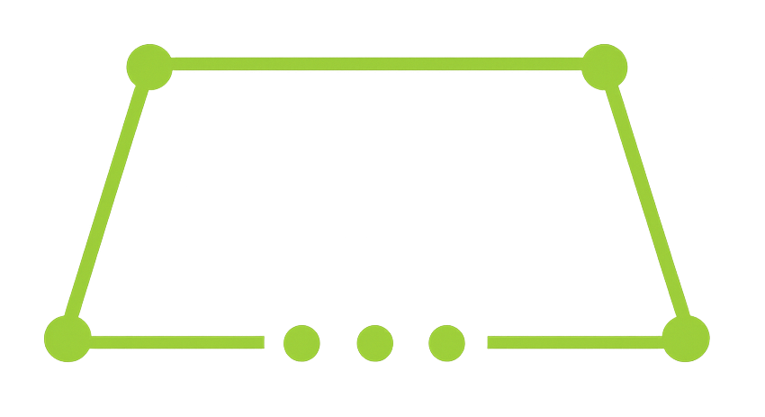

# gorbit

<p align="center">
  
</p>

<p align="center">
A lightweight, fast, and expressive web framework for Go inspired by the simplicity of Express.js.
</p>

<p align="center">


</p>

---

## Why Gorbit?

Gorbit is designed to provide an Express-like developer experience while embracing Go's performance and concurrency.

### Features

* 🚀 Lightweight with zero unnecessary abstractions
* ⚡ Fast HTTP router
* 📦 Modular middleware system
* 🔌 Built-in WebSocket support
* 📁 Route mounting
* 🎯 URL parameters
* 🔄 Middleware chaining
* 🧩 Simple and expressive API
* ❤️ Easy to learn for Node.js developers

---

# Installation

```bash
go get github.com/pav-studio/gorbit
```

---

# Quick Start

```go
package main

import (
	gb"github.com/pav-studio/gorbit"
	"github.com/pav-studio/gorbit/middleware"
)

func main() {

	app := gb.New(3000)

	app.Use(middleware.AllowAllCORS())

	app.GET("/status", func(c *gb.Ctx) {
		c.String(200, "healthy")
	})

	app.Start()
}
```

Run:

```bash
go run .
```

Server:

```
http://localhost:3000
```

---

# Routing

### GET

```go
app.GET("/users", func(c *gb.Ctx) {
	c.JSON(200, []string{"Alice", "Bob"})
})
```

### POST

```go
app.POST("/users", func(c *gb.Ctx) {

})
```

### PUT

```go
app.PUT("/users/:id", func(c *gb.Ctx) {

})
```

### DELETE

```go
app.DELETE("/users/:id", func(c *gb.Ctx) {

})
```

---

# Route Parameters

```go
app.GET("/users/:id", func(c *gb.Ctx) {

	id := c.Param("id")

	c.String(200, id)

})
```

Request:

```
GET /users/42
```

Response:

```
42
```

---

# Middleware

Global middleware:

```go
app.Use(middleware.AllowAllCORS())
```

Custom middleware:

```go
app.Use(func(c *gb.Ctx) {

	println(c.Request.Method)

	c.Next()

})
```

---

# Router Groups

```go
api := gb.NewRouter()

api.GET("/users", handler)

app.Mount("/api", api)
```

Routes become:

```
GET /api/users
```

Router middleware:

```go
api.Use(AuthMiddleware)
```

---

# CORS

Allow everything:

```go
app.Use(middleware.AllowAllCORS())
```

Custom configuration:

```go
app.Use(middleware.CORS(
	middleware.CORSOptions{
		AllowOrigins: []string{
			"http://localhost:5173",
		},
		AllowMethods: []string{
			"GET",
			"POST",
		},
		AllowHeaders: []string{
			"Authorization",
			"Content-Type",
		},
		AllowCredentials: true,
		MaxAge: 3600,
	},
))
```

---

# Responses

String

```go
c.String(200, "Hello World")
```

JSON

```go
c.JSON(200, map[string]any{
	"success": true,
})
```

Status

```go
c.Status(204)
```

---

# WebSockets

```go
app.WS("/chat", func(client *gb.WSClient) {

	client.OnConnect(func(c *gb.WSClient) {
		println("Connected")
	})

	client.On("message", func(data any) {
		println(data)
	})

})
```

---

# Project Structure

```
my-api/
│
├── main.go
├── go.mod
│
├── routes/
│   ├── api.go
│   └── auth.go
│
├── middleware/
│
├── controllers/
│
├── services/
│
└── models/
```

---

# Examples

Example projects are available inside the `examples/` directory.

```
examples/
├── hello-world
├── websocket
└── rest-api
```

---

# Roadmap

* [x] HTTP Router
* [x] Middleware
* [x] Router Mounting
* [x] WebSockets
* [x] Route Parameters
* [ ] Static File Serving
* [ ] Template Rendering
* [ ] Logger Middleware
* [ ] Recovery Middleware
* [ ] Cookie Helpers
* [ ] Multipart Uploads
* [ ] Request Validation
* [ ] JWT Middleware
* [ ] Rate Limiter
* [ ] Session Support
* [ ] OpenAPI Generator

---

# Contributing

Contributions are welcome.

1. Fork the repository.
2. Create a feature branch.
3. Commit your changes.
4. Open a Pull Request.

---

# License

This project is licensed under the MIT License.

---

# Links

* GitHub: https://github.com/pav-studio/gorbit
* Documentation: https://gorbit.orbit-technologies.org/docs
